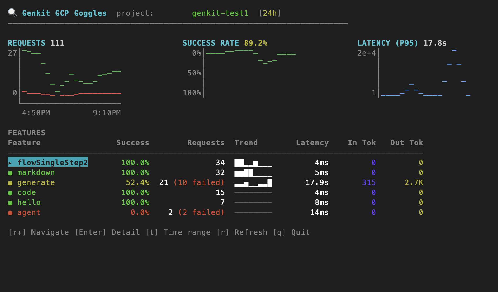

# 🔍 genkit-gcp-goggles

**See what your Genkit AI app is doing in production. Right from your terminal.**

<p align="center">
  
</p>

A full terminal dashboard that pulls real-time metrics, traces, and span I/O from Google Cloud for your [Genkit](https://github.com/firebase/genkit) apps. No browser needed. No port forwarding. Just run it.

## Why?

You deployed your Genkit app. It's running on Cloud Run (or GKE, or wherever). You want to know:

- **How many requests** is each feature handling?
- **What's the success rate?** Any failures spiking?
- **How fast** are responses? What's the p95 latency?
- **How many tokens** are you burning through?
- **What did the LLM actually say?** What was the input? The output?

Get all of that in one place with a single command:

```bash
npx genkit-gcp-goggles --project my-project
```

## Features

- **Overview dashboard** with request charts, success rates, latency, and token counts across all your Genkit features
- **Feature drill-down** with time-series charts for requests, latency (p50/p95), tokens, and success rate
- **Trace list** with pagination, status indicators, duration, and model names
- **Trace viewer** with a collapsible span tree and full span detail panel
- **On-demand I/O loading** from Cloud Logging (press `i` to fetch full input/output for any span)
- **Keyboard-driven** with vim-style navigation (j/k), drill-in/out, time range picker
- **Smart caching** with LRU cache and TTLs so you're not hammering APIs
- **Retry with backoff** for rate-limited API calls (429s)
- **Helpful error messages** with specific instructions for auth, permissions, and setup issues

## Quick Start

### Prerequisites

- Node.js 18+
- [Google Cloud SDK](https://cloud.google.com/sdk/docs/install) (`gcloud`) installed
- A GCP project with a Genkit app sending telemetry

### 1. Authenticate

```bash
gcloud auth application-default login
```

### 2. Run

```bash
npx genkit-gcp-goggles --project YOUR_PROJECT_ID
```

Or install globally:

```bash
npm install -g genkit-gcp-goggles
genkit-gcp-goggles -p my-project -r 7d
```

## Usage

```
$ genkit-gcp-goggles [options]

Options
  --project, -p    GCP project ID (defaults to gcloud default project)
  --range, -r      Time range: 1h, 6h, 24h, 7d, 30d (default: 24h)
  --help           Show help
  --version        Show version
```

### Keyboard Navigation

| Key | Action |
|-----|--------|
| `j` / `k` or `↑` / `↓` | Navigate lists |
| `Enter` | Drill into feature or trace |
| `Esc` / `←` | Go back |
| `t` | Change time range |
| `r` | Refresh data (clears cache) |
| `i` | Load and view full I/O from Cloud Logging |
| `Space` / `→` | Toggle span collapse in trace viewer |
| `n` / `p` | Next/previous page in trace list |
| `q` | Quit |

## Setting Up Your Genkit App

For genkit-gcp-goggles to show data, your Genkit app needs to send telemetry to Google Cloud. Install the `@genkit-ai/google-cloud` plugin:

```bash
npm install @genkit-ai/google-cloud
```

Then enable it in your Genkit app's entry point:

```typescript
import { enableGoogleCloudTelemetry } from '@genkit-ai/google-cloud';

enableGoogleCloudTelemetry();
```

This exports metrics to **Cloud Monitoring**, traces to **Cloud Trace**, and I/O logs to **Cloud Logging** when running on GCP (Cloud Run, GKE, etc.).

### Testing locally

By default, telemetry is only exported in production. To export telemetry when running locally (so you can test with genkit-gcp-goggles), use the `forceDevExport` option:

```typescript
enableGoogleCloudTelemetry({
  forceDevExport: true, // export telemetry even in dev mode
});
```

### Other useful options

```typescript
enableGoogleCloudTelemetry({
  projectId: 'my-project',             // override auto-detected project
  forceDevExport: true,                 // export in dev mode
  disableLoggingInputAndOutput: true,   // skip logging I/O (for privacy)
  disableMetrics: true,                 // skip metrics export
  disableTraces: true,                  // skip trace export
});
```

See the [Genkit Google Cloud plugin docs](https://firebase.google.com/docs/genkit/plugins/google-cloud) for the full list of configuration options.

## Required GCP Permissions

Your authenticated account needs these read-only IAM roles on the project:

- `roles/monitoring.viewer` - for Cloud Monitoring metrics
- `roles/cloudtrace.user` - for Cloud Trace spans
- `roles/logging.viewer` - for Cloud Logging I/O data

## How It Works

No backend server needed. The CLI runs entirely in your terminal and calls Google Cloud APIs directly using your Application Default Credentials (ADC). It reads from three APIs:

- **Cloud Monitoring v3** for feature-level metrics (request counts, latency, token usage)
- **Cloud Trace v1** for distributed traces and span trees
- **Cloud Logging v2** for full span input/output data (loaded on-demand)

All access is **read-only**. Responses are cached in-memory with an LRU cache to keep things fast and avoid unnecessary API calls.

## Development

```bash
git clone https://github.com/pavelgj/genkit-gcp-goggles.git
cd genkit-gcp-goggles
pnpm install
pnpm start -- --project YOUR_PROJECT_ID
```

## License

Apache-2.0
